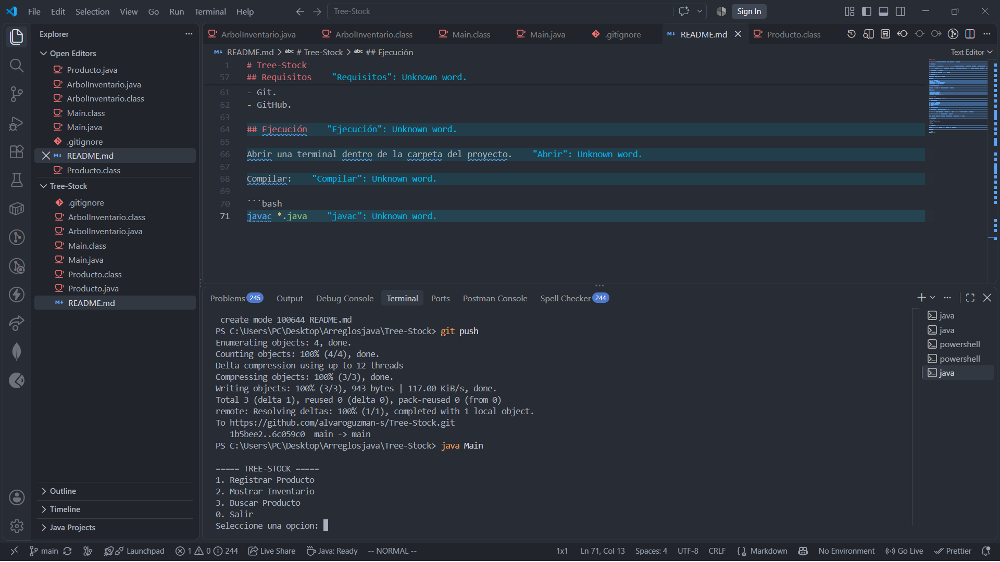
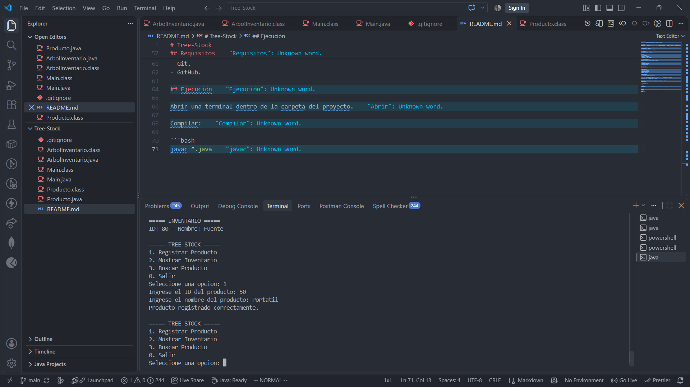
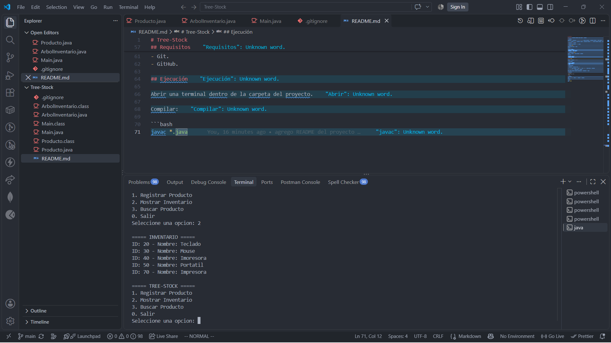
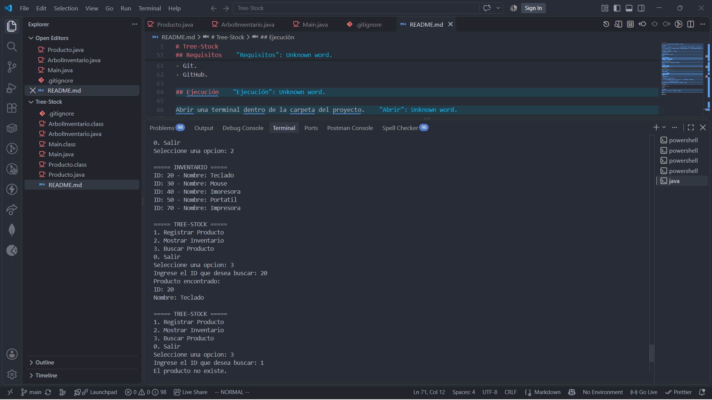

# Tree-Stock

## Sistema de Inventario mediante Árbol Binario de Búsqueda

### Objetivo

Desarrollar una aplicación de consola en Java que permita gestionar un inventario mediante un árbol binario de búsqueda.

El sistema permite registrar productos, mostrar el inventario ordenado por ID y buscar productos mediante su identificador.

## Estructura del proyecto

El proyecto está dividido en tres clases:

### Producto.java

Representa cada nodo del árbol.

Contiene:

* ID del producto.
* Nombre del producto.
* Referencia al nodo izquierdo.
* Referencia al nodo derecho.

### ArbolInventario.java

Contiene la lógica del árbol binario de búsqueda.

Implementa:

* Inserción recursiva.
* Recorrido inorden.
* Búsqueda recursiva por ID.

### Main.java

Contiene la interfaz de consola.

El menú permite:

1. Registrar Producto.
2. Mostrar Inventario.
3. Buscar Producto.
4. Salir.

## Funcionamiento

Los productos se organizan según su ID.

* Si el ID del nuevo producto es menor que el ID del nodo actual, se dirige hacia la izquierda.
* Si el ID es mayor, se dirige hacia la derecha.
* La inserción se realiza de forma recursiva.
* El recorrido inorden permite mostrar los productos ordenados por ID.
* La búsqueda utiliza la estructura del árbol para encontrar un producto por su ID.

### Ejemplo de estructura del árbol

```text
        50
       /  \
     30    70
    /  \
   20   40
```

En este ejemplo, el producto con ID 50 es la raíz. Los productos con ID menor se ubican a la izquierda y los productos con ID mayor se ubican a la derecha.

## Requisitos

Para ejecutar el proyecto se necesita:

* Java JDK.
* Visual Studio Code.
* Git.
* GitHub.

## Ejecución

Abrir una terminal dentro de la carpeta del proyecto.

### Compilar

```bash
javac *.java
```

### Ejecutar

```bash
java Main
```

## Menú principal

El programa presenta las siguientes opciones:

```text
===== TREE-STOCK =====
1. Registrar Producto
2. Mostrar Inventario
3. Buscar Producto
0. Salir
Seleccione una opcion:
```

## Capturas de pantalla

Las siguientes capturas muestran la ejecución del programa:

### 1. Menú principal



### 2. Registro de productos



### 3. Inventario ordenado



### 4. Búsqueda de producto



## Video de sustentación

En el siguiente enlace se encuentra el video de sustentación del proyecto:

[Ver video de sustentación](https://www.youtube.com/watch?v=nSnrbeePu1o)

## Repositorio en GitHub

El código fuente del proyecto se encuentra disponible en el siguiente repositorio:

[Ver repositorio Tree-Stock en GitHub](https://github.com/alvaroguzman-s/Tree-Stock)

## Autor

**Alvaro Guzman**
